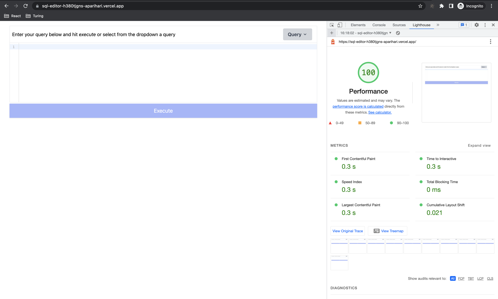

## SQl Editor

This a Next.js project, which uses React.js under the hood for UI components. As per the requirement of the project the project is not a full blown SQL parser or executor. The project is certainly an editor and uses CodeMirror editor under the hood.

### Features
- SQL Editor
- On Execution of query, displaying mock data
- Provides pre-selected queries and displays mock data on it's selection
- Disabled the execute button if there is no query in the editor

### Performance of the application

- All the core web vitals are within 1s as we can see the performance tab results

### Optimizations
The project is using Next.js to optimize the first initial load the application. As we know Next.js by default uses Static Site Generation technique to optimize the performance of the application and later on hydrates the same. The same can be seen for this application due to which the initial load time of the application is very low.

### Big tables

I have not included any strategy at this point in time in this project to handle the big tables but we can use infinite scrolling or pagination to handle big data.

